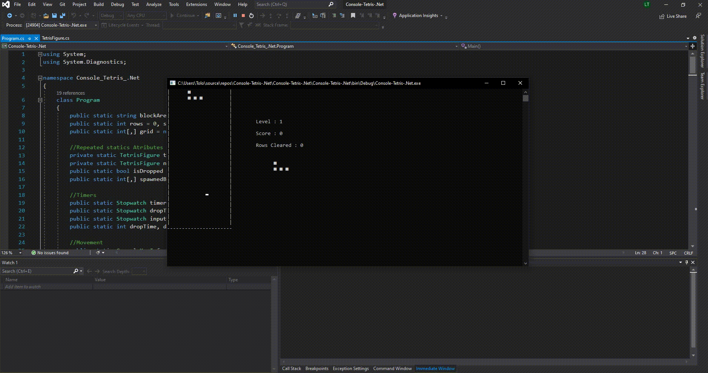

# Console Tetris .Net // FULL COMMENTED

### Contributor: Leandro Toloza

## Description:

### Console Tetris .NET is a project of Tetris Videogame which provides the user a tetris game in Console. 

## Features:

  - Full Commented Program (Explain what does each thing do)
  - Menu
  - Score
  - Levels (+score == +difficult)
  - Figure Rotation
 
## Instructions

  - Clone Repository
  - Run on Console

## Controls

  - Keyboard Arrows (Up, Down, Left, Right)
  - Spacebar (To Rotate)
  - Up | Down Key Increases Figure Drop Speed 
